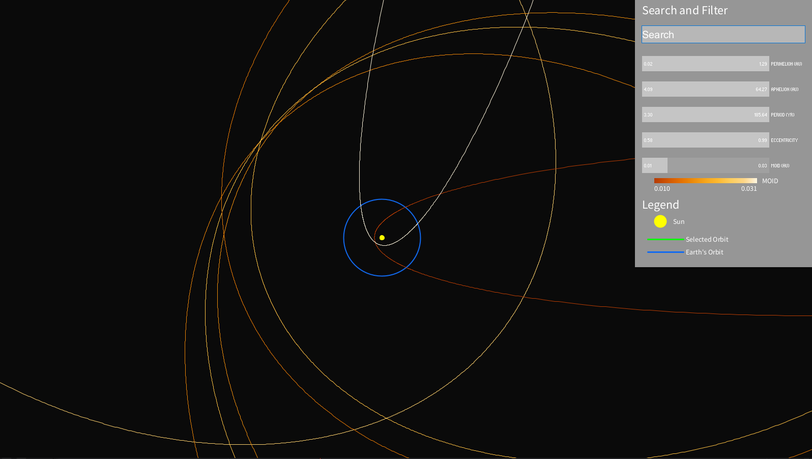
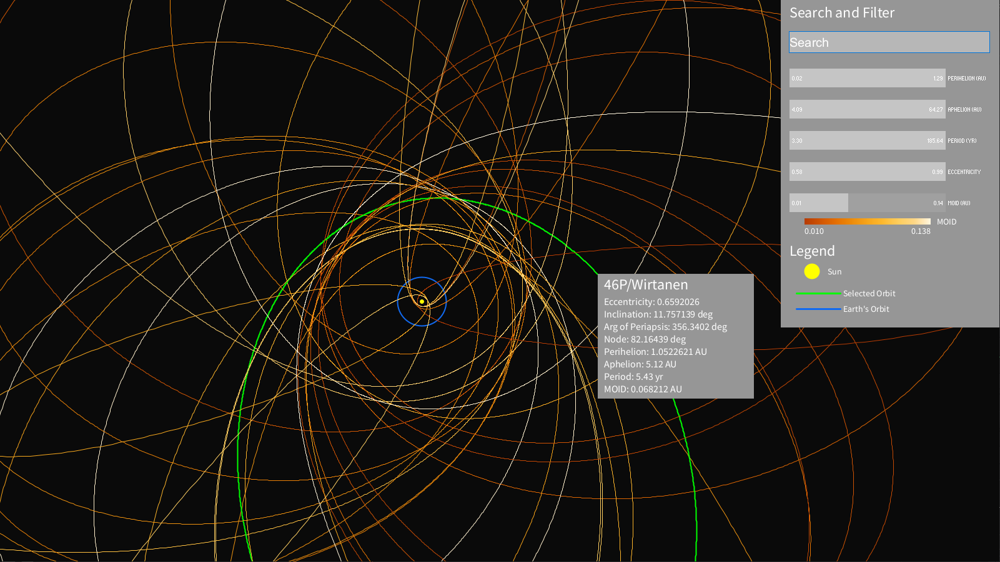

# Visualizing Near-Earth Comets

Data visualization of the NASA Near-Earth Comets - Orbital Elements dataset for CSCI 5609 (Visualization) at the University of Minnesota. The visualization allows a user to search, filter, and select comet orbits to aid in data exploration.

## Project Members
- Brett Duncan
- Ethan Osmundson
- Matthew Rajala

## Data
Near-Earth Comets - Orbital Elements: https://data.nasa.gov/Space-Science/Near-Earth-Comets-Orbital-Elements/b67r-rgxc